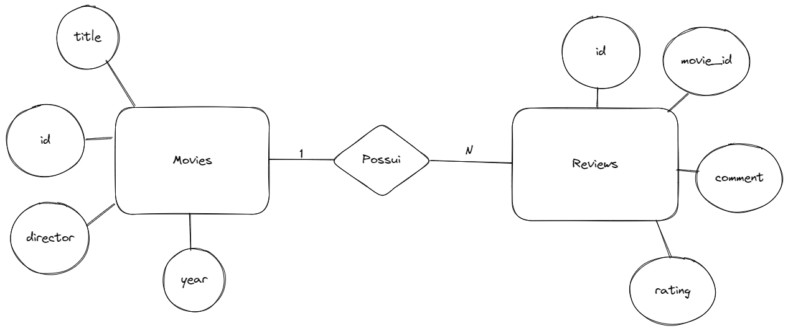
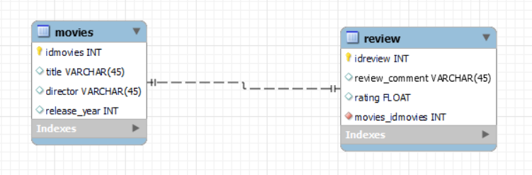
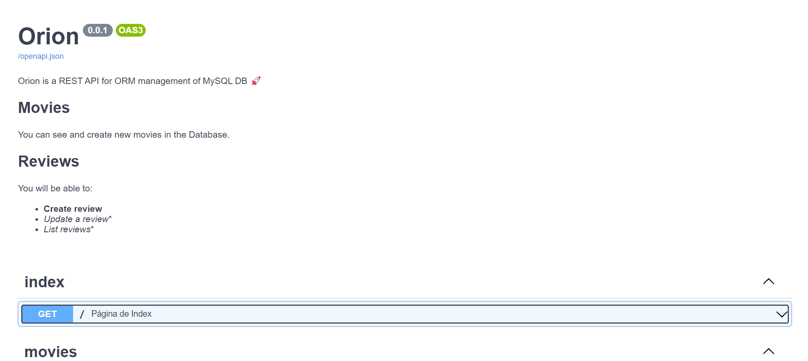

## Projeto SQL Orion
<div align="center" style="max-width:68rem;">

<center></center>
</div>

<div align="center" style="max-width:68rem;">
<table>
  <tr>
    <td align="center"><a href="https://github.com/matheus-1618"><br /><sub><b>Matheus Oliveira</b></sub></a><br /><a href="https://github.com/matheus-1618" title="Matheus Silva M. Oliveira"></a> Developer</td>
   <td align="center"><a href="https://github.com/niveaabreu"><br /><sub><b>Nívea de Abreu</b></sub></a><br /><a href="https://github.com/niveaabreu" title="Nívea de Abreu"></a>Developer</td>
  </tr>
</table>
</div>


### Descrição
Orion é um projeto de REST API, que permite o gerenciamento filmes e reviews (avaliações), permitindo a 
bysca por filmes no sistema, avaliações gerais cadastradas, avaliações de filmes específicos, e até o rating médio de um filme especificado na plataforma.

### Executando
Antes de rodar a API, abra o MySQL WorkBench e execute a query presente no arquivo **script.sql** para criar a base e suas tabelas.

Crie dentro do diretório, um arquivo **.env** que siga os campos do arquivo **.env.example**. Este será importante para validar suas credenciais para acesso ao banco de dados.

Após criar o ambiente virtual (caso deseje), instale as dependências necessárias:
```bash
python -m pip install -r requirements.txt
```

Após a instalação, para rodar o projeto, abra um terminal e execute o comando abaixo:
```bash
uvicorn main:app --reload
```

Em seguida, abra um navegador e digite:

**http://127.0.0.1:8000/docs**

Você deverá ver a seguinte interface, descrevendo todas as endpoints disponíveis e métodos utilizáveis, tal qual:

* Títulos das chamadas
* Descrição dos métodos
* Descrição de parâmetros
* Descrição de *request body*
* Exemplo de *request body*
* Status code de retorno da response
* Headers da response


### Diagrama Entidade Relacionamento

<center></center>

### Diagrama Relacional

<center></center>

### Visão geral da API

<center></center>


### Requisitos solicitados

* :heavy_check_mark: Sistema de gerenciamento de filmes e avaliações de filmes
* :heavy_check_mark: Sistema CRUD para controle das requisições
* :heavy_check_mark: API RESTful
* :heavy_check_mark: Arquitetura Client-Server
* :heavy_check_mark: Ausência da noção de sessão
* :heavy_check_mark: Sistema encapsulado em camadas
* :heavy_check_mark: Sistema baseado em recursos, com identificação direta para filmes(/movies), avaliações(/reviews) ou average(/average)
* :heavy_check_mark: Especificação de ação via protocolo HTTP
* :heavy_check_mark: Response com headers, código de status e metadados
* :heavy_check_mark: Tipos de BaseModel utilizados para requisições (Movie_request e Review_Request)
* :heavy_check_mark: Descrição informativa da documentação da API (títulos de chamadas, organização por tags de segmentos, exemplos de request body, descrição de argumentos entre outros)
    
©Insper, 6° Semestre Engenharia da Computação, MegaDados.


